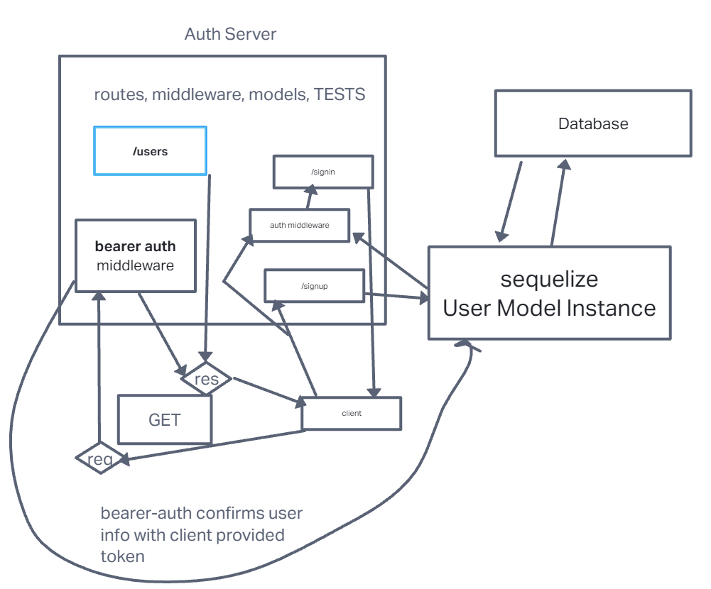

# LAB - 07

## Project: bearer-auth

### Author: Ike Steoger

### Problem Domain

This is a basic server with basic authentication, both `basicAuth` and `bearerAuth`.

### Links and Resources

- [GitHub Actions ci/cd](https://github.com/IkeSteoger/bearer-auth/actions)
<!-- - [back-end dev server url]() -->
- [back-end prod server url](https://bearer-auth-khd3.onrender.com)

### Collaborators

Started with CodeFellows starter code.

### Setup

#### `.env` requirements (where applicable)

See the `.env.sample`

#### How to initialize/run your application (where applicable)

Clone repo, `npm i`, set up DB with `npm run init:config` & then `npm run db:create` then run `nodemon` in the terminal

#### Routes

- GET : `/` - server is live route

#### Tests

To run tests, after running `npm i`, run the command `npm test`

#### UML

